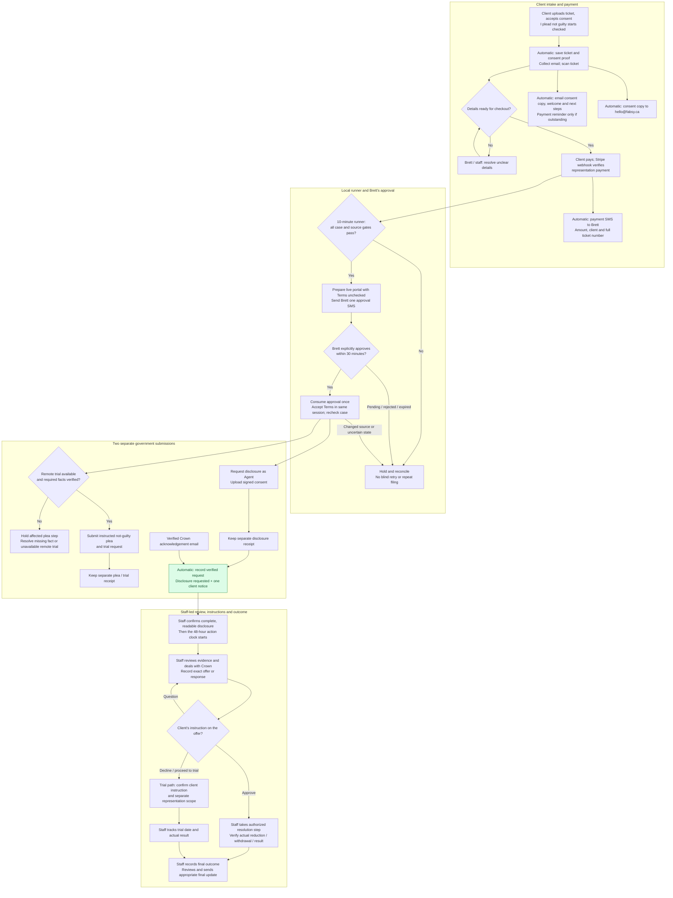

# Fabsy ticket workflow

This describes the ticket representation workflow as reviewed on September 20, 2026. **Client** means a customer decision; **Brett/staff** means an action requiring human judgment; **automatic** means existing application or scheduled processing. The portal runner checks every **10 minutes** on Brett's Mac. It needs Codex, the Mac, the connected browser and authenticated access to remain available. Payment does not directly submit a court form.

**Request confirmation rule:** a verified portal receipt or matched Crown acknowledgment records the request, updates an eligible early case to **Disclosure requested**, and queues one client notice. Existing notices and later case stages are preserved. Backend and frontend deployment are verified separately in the release record.

The two portal branches are independent. A disclosure receipt proves neither a not-guilty plea nor a trial request. A plea receipt proves neither disclosure submission nor receipt of police evidence. The private filing ledger becomes `partial` after one confirmed step and `completed` after both; this **filing** completion does not mean the legal case is resolved. A held plea can resume only after the missing instruction and session/authority checks are satisfied.

## 1. One-and-done upload and consent

The new English intake lets the client upload a ticket and accept consent together. **“I plead not guilty” is checked by default**, while the separate authorization/consent checkbox requires the client's acceptance. The server stores the actual plea choice and its wording in versioned consent evidence and the generated PDF. Unchecking the plea still permits intake; it does not authorize a not-guilty filing. Older records do not acquire a new checked choice retrospectively.

After the ticket and consent are saved, the client supplies a required email address and optional phone number for updates. Image extraction suggests the ticket details; PDFs, failed scans, unclear classifications, missing required details and out-of-scope flags require staff review. The intake states are `pending_scan → scanning → ready` or `needs_review`. A `ready` scan is not visual verification of the original document. An interrupted contact step leaves the saved ticket and consent intact; email delivery waits until the address and ticket reference are available. Camera notices ask the registered-owner question before checkout.

A saved consent queues a client welcome with the actual PDF and next steps, independent of checkout navigation. The worker checks current representation payment evidence before adding a payment reminder. The existing staff event sends the consent to hello@fabsy.ca. Full stored ticket numbers appear in both subjects; missing identity/documents hold delivery. Queue ownership prevents a second checkout welcome or contradictory abandoned-consent reminder. Historical and uncertain sends are not replayed. See [consent welcome release](CONSENT_WELCOME_RELEASE.md) for deployment evidence.

The localized and existing detailed intake remains a separate supported path. For a legacy officer-issued file, a verified explicit `not_guilty` selection can supply the plea instruction. A default strategy, missing quick-intake choice or an explicit false choice cannot replace client authority.

## 2. Payment and eligibility

Stripe's verified payment webhook records the matching representation checkout and payment evidence. A browser success page, a checkout link, the staff label **Paid**, or purchase of an insurance report alone is insufficient. Failed or expired checkout remains unpaid. Refunds and disputes feed payment holds.

The runner checks the whole paginated queue and its existing private ledger/pending approval before opening another case. All of these must hold:

- Active representation, actual matching payment, no soft deletion or recorded final outcome, and no unresolved refund/dispute hold.
- One unambiguous normalized ticket; no prior receipt, consumed attempt or uncertain final click for the particular step about to be submitted.
- Effective staff stage absent, **Partial intake**, or **Paid**. Canonical submission status wins over linked-draft status; conflicting inherited statuses require reconciliation. Later stages block a new automatic filing. Inherited staff status must survive draft cleanup.
- Original ticket and signed consent are available, visually matched to the case, with a documented not-guilty instruction and no withdrawal of authority. The runner must inspect consent/instructions; a stored file path alone does not establish continuing authority.
- For quick photo intake, review status is `ready`; missing identity, required portal facts or unsupported documents are resolved first.

Staff labels and payment records are separate. Changing a dropdown does not pay a fee, submit a plea, accept a Crown offer or prove a government receipt.

## 3. Terms approval and portal actions

The runner prepares the live ticket lookup with the Terms checkbox **unchecked**, reads the actual current Terms, verifies the documents and sends Brett one case-specific SMS. The approval lasts **30 minutes** and binds the case, exact consent, Terms and prepared browser session. Opening the SMS link does not approve it. Only Brett's explicit approval allows the runner to consume it once and accept the Terms. A phone approval is not a filing receipt.

Use **Brett Bilon / Fabsy Traffic Ticket Services**, representative type **Agent**, and **hello@fabsy.ca**. Select **No email address** for the defendant where the form asks. The disclosure form requires the verified signed consent upload. The plea/trial form is a different submission.

Interpreter and witnesses other than the defendant default to **No**, unless the specific case records a need. **Remote is always the first choice** for trial appearance requests under Brett’s September 20 instruction. Select **Online by virtual trial** when available. Brett also confirmed **always Yes** for stable high-speed internet, camera and microphone questions. Verify other factual prerequisites from the case; hold the plea if a required fact is missing or remote is unavailable. The independent disclosure step may proceed when its own facts and approval permit it.

Immediately before each final click, recheck current case/staff status, payment and holds, documents, consent and instruction, and the step ledger. Reserve the step, click once, and retain the actual reference, timestamp and screenshot. A crash or unclear result leaves that step held until reconciled. A lost browser session after approval consumption or a partial filing does not permit an automatic restart.

## 4. Receipt, staff status and the client notice

The receipt rule joins two sources: a verified portal request receipt and a verified Crown acknowledgement email. They must resolve to one request record for the ticket, preserve their evidence, advance only an eligible early staff stage to **Disclosure requested**, and use the existing notification outbox. Later or closed staff stages must not be moved backwards.

The client receives one logical, deduplicated transactional notice identifying the full ticket number and saying disclosure has been requested. It must not claim a plea was filed, evidence arrived, a deal was reached or a trial was scheduled. The current notice includes no estimated wait; a portal receipt does not supply one.

The existing cloud worker checks the outbox every **minute**, independently of Brett's Mac, and sends through Google Workspace Gmail. One outbox record, frozen content, an exclusive lease and a saved acceptance receipt prevent normal repeat sends. Gmail’s deterministic Message-ID is audit metadata, not a send-idempotency guarantee: any failed or expired attempt is held for review immediately, without automatic resend. Gmail acceptance is not proof of inbox delivery. The local portal runner sends no additional courtesy email on top of this outbox notice.

An acknowledgement is only confirmation of a **request**. It does not extend a deadline, mark the police evidence complete, or start the 48-hour review/action commitment. Staff must separately verify complete, readable disclosure and match it to the file.

## 5. Crown offer, client instruction and outcome

Evidence review, negotiation, assessment of a Crown response, required client instruction and final legal action remain **staff-led**. The 48-hour commitment concerns Fabsy's review and next authorized action after complete disclosure; it does not promise a Crown reply or final result within that time.

| Recorded stage | What it establishes / next action |
| --- | --- |
| Partial intake / Paid | Intake/workflow position; verify documents and actual payment separately. |
| Disclosure requested | A request has been recorded; wait for and check the actual evidence. |
| Crown offer received | Staff records the actual response and obtains the client's instruction. |
| Done — ticket reduced / voided or withdrawn | Staff verifies and records the actual final result. |
| Crown offer rejected — client proceeding to trial | Record the client's decision and clarify trial scope; this is not a trial booking or new retainer. |
| Trial date pending / set | Staff tracks the actual scheduling information and required next actions. |
| Trial concluded — ticket reduced / upheld | Staff records the court result. |
| Lapsed/expired | A staff-recorded exception requiring review; not an inferred dismissal or automatic success. |

For **photo radar**, the app additionally supports structured ATE evidence review, versioned Crown offers, a secure client approve/decline/question response, and an actual outcome record. Approving an offer records the client's instruction; staff still has to take the authorized Crown step. ATE update drafts are staff handoffs, not automatically sent messages. The photo-radar service does not include trial representation; Rapid Resolution trial representation also requires separate scope. Neither the staff trial labels nor this diagram expands the purchased service.

After recording the actual outcome, staff can review and explicitly send the supported final case update. Changing a case-stage dropdown alone is not a general-purpose email trigger. Automatic Crown negotiation, automatic acceptance of deals, universal automated client-offer decisions, trial attendance and automatic final-outcome determination are **not implemented** by the disclosure runner.

## Optional insurance report branch

For eligible officer-ticket clients, the Insurance Impact & Renewal Planning Report can be purchased with representation or separately. Its branch is: **verified report payment → private report intake and driver abstract → staff review and source checks → generated report and delivery**. It has separate order states (`paid`, `awaiting_abstract`, `in_review`, `delivered`). It neither authorizes representation nor blocks or substitutes for a disclosure request. Photo-radar checkout does not include this add-on. A later supported report offer is optional, not an automatic extra purchase.

## Holds and recovery

| Trigger | Required response |
| --- | --- |
| Unpaid, refund/dispute hold, withdrawn consent, false/missing plea authority | Stop filing; obtain verified resolution/instruction. Never infer payment or permission. |
| Duplicate ticket, ambiguous match or inherited status, prior receipt | Reconcile the exact case and individual step; preserve existing evidence. |
| Later staff stage, deleted case or changed snapshot/version | Stop a fresh attempt; review current case work before any continuation. |
| Expired/rejected/revoked approval, changed Terms/consent/session, uncertain SMS | Do not accept Terms or automatically resend; reconcile and obtain valid case-specific permission when appropriate. |
| Remote trial unavailable or another required fact missing | Hold the affected step. Preserve any independently confirmed disclosure receipt. |
| CAPTCHA, unexpected agreement, unavailable portal or unclear final-click result | Hold for human intervention. Do not bypass, guess or click again blindly. |
| Invalid/unmatched Crown email or uncertain client-email delivery | Retain evidence and review the exception; do not guess a match or send another notice blindly. |

The runner stays quiet when nothing actionable changes. It reports confirmed filing, delivery failure, a material exception or a decision Brett must make. Existing deadlines remain independently important throughout the workflow.

## Implementation references

- Intake, immutable plea proof and scanning: `src/components/QuickTicketIntake.tsx`, `PhotoUploadConfirmation.tsx`, `supabase/functions/_shared/intake-consent.ts`, `process-photo-intake.ts` and migration `20260920140000_intake_plea_instruction.sql`.
- Checkout/payment: `supabase/functions/create-payment/index.ts` and `idr-payment-webhook/index.ts`.
- Runner, source gates, per-step receipts and phone approval: [Disclosure automation](DISCLOSURE_AUTOMATION.md), `scripts/disclosure-automation/`, `supabase/functions/disclosure-approval/`, migrations `20260920150000_disclosure_remote_approval.sql` and `20260920213000_disclosure_case_status_guard.sql`.
- Crown-email ingestion, outbox and recovery: [Disclosure confirmation operations](DISCLOSURE_CONFIRMATION_OPERATIONS.md), `process-disclosure-notices`, `_shared/gmail-disclosure-inbox.ts` and `_shared/disclosure-delivery.ts`.
- Staff stages, ATE/client instructions and final updates: `src/lib/admin/caseStatus.ts`, `src/components/AteCaseReview.tsx`, `ResolutionEmailAction.tsx` and `supabase/functions/send-idr-case-update/index.ts`.
- Optional report: `src/pages/IdrIntake.tsx`, `AdminIdrReview.tsx`, `IdrReportPage.tsx` and `supabase/functions/generate-idr-report/index.ts`.
